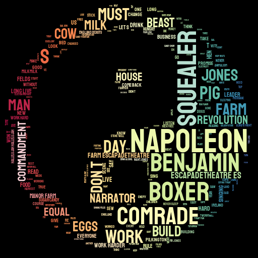
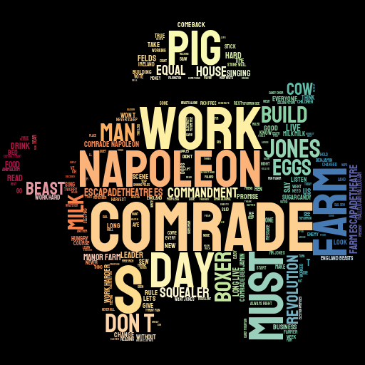
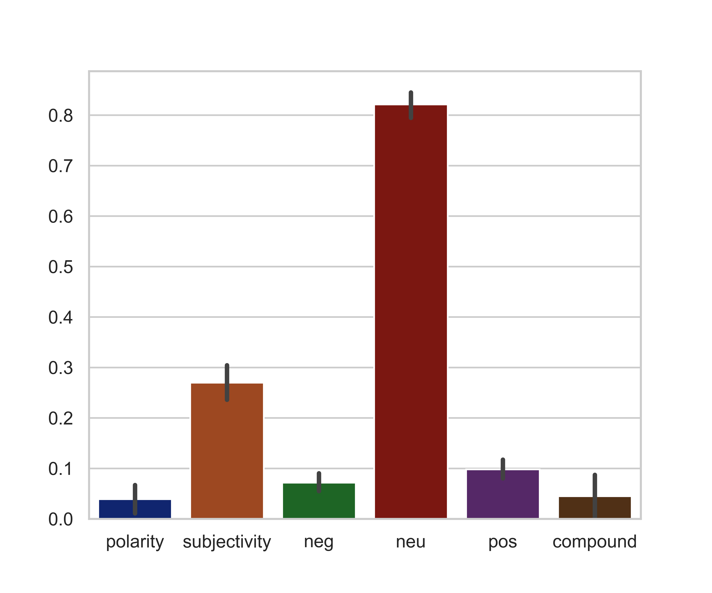

## Sentiment analysis API.
Maximiliano Tabó

### Table of Contents:
**1-Intro.**
**2-Goal.**
**3-Data.**
**4-Steps.**
**5-Visualizations and Conclusions.**

### 1-Intro.
The project is about creating a local API from a chosen info. 
In this case, I decided to use a script from the book 'Animal Farm' written by Eric Arthur Blair better known as George Orwell.

It tells the story of a group of farm animals who rebel against their human farmer, hoping to create a society where the animals can be equal, free, and happy. Ultimately, the rebellion is betrayed, and the farm ends up in a state as bad as it was before, under the dictatorship of a pig named Napoleon.
The book is a metaphor of the Communism.

### 2-Goals.
- Create our own API
- Design the structure of your own database depending on the type of info you want to store.
- Write an API using flask to receive chat messages and store them in a database (mysql).
-  Read and serve data from the chats database using different endpoints.
- Extract the emotional value of messages per user/chats and make it queryable through an endpoint.
- Post information through the API.

### 3-Data.
In order to run the project the following libraries are needed to be installed:

*-requests*
*-sqlalchemy*
*-pandas* 
*-re*
*-json_normalize*
*-json*
*-os*
*-seaborn* 
*-numpy*
*-getpass*
*-wordcloud*
*-Image*
*-spacy*
*-nltk*
*-SentimentIntensityAnalyzer*
*-Flask*
*-stylecloud*
*-os*

### 4-Steps.
Gather the information from the Internet.
Load the file into the Jupyter Notebook.
After loading the file, using Regex in order to split names and text to create a Dataframe.
Save it to proceed to import the csv file from SQL.
Set the route with Flask and build the functions needed.
Test the API to check if it was working properly.

### 5-Visualizations.
  
   

    
####   &ensp;&ensp;&ensp;&ensp;&ensp;&ensp;&ensp;&ensp;&ensp;&ensp;&ensp;&ensp;&ensp;  &ensp;&ensp;        &ensp;&ensp; raw script.
  
  

 

 #### &ensp;&ensp;&ensp;&ensp;&ensp;&ensp;&ensp;&ensp;&ensp;&ensp;&ensp;&ensp;&ensp;&ensp;&ensp;&ensp;only dialogues.

  
 
#### &ensp;&ensp;&ensp;&ensp;&ensp;&ensp;&ensp;&ensp;&ensp;&ensp;&ensp;Compound boxplot.
 
#### &ensp;&ensp;&ensp;&ensp;&ensp;&ensp;&ensp;&ensp;&ensp;&ensp;&ensp; Mean Positivity
 
#### &ensp;&ensp;&ensp;&ensp;&ensp;&ensp;&ensp;&ensp;&ensp;&ensp;&ensp;Sentiment quality.
 
#### &ensp;&ensp;&ensp;&ensp;&ensp;&ensp;&ensp;&ensp;&ensp;&ensp;&ensp; Correlation test.
 
 

##### Links and Resources
www.dramaticpublishing.com